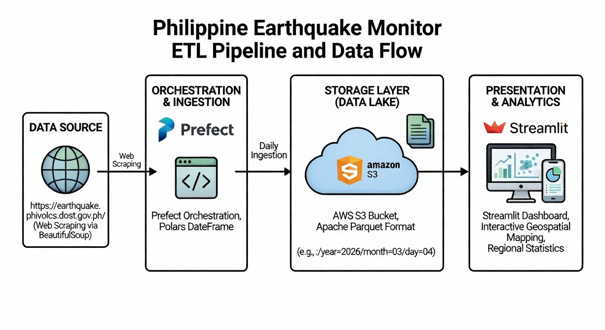

# 🌏 Philippine Earthquake Monitor — ETL Pipeline

A daily ETL pipeline that scrapes earthquake data published by [PHIVOLCS](https://earthquake.phivolcs.dost.gov.ph/), transforms it, and stores it in AWS S3 as partitioned Parquet files. A Streamlit app reads directly from S3 to serve interactive geospatial visualizations and regional statistics.

---

## Architecture Diagram



---

## How It Works

1. **Extract** — BeautifulSoup scrapes the previous day's earthquake records from the PHIVOLCS website every day at 12:01 AM (Asia/Manila).
2. **Transform** — Polars cleans and enriches the raw data: depth and magnitude are classified into human-readable categories, province is extracted from the location string, and datetime is parsed and split into date/time components.
3. **Load** — The transformed DataFrame is written to an AWS S3 bucket in Apache Parquet format, partitioned by `year/month/day`.
4. **Orchestration** — The pipeline runs on Prefect Cloud using a managed work pool on a daily schedule.
5. **Presentation** — A Streamlit app reads the Parquet files directly from S3 and renders an interactive dashboard with geospatial mapping and regional statistics.

---

## Tech Stack

| Layer | Tool |
|---|---|
| Orchestration | Prefect Cloud (Managed Work Pool) |
| Scraping | httpx, BeautifulSoup4 |
| Transformation | Polars |
| Storage | AWS S3 (Apache Parquet, Hive partitioning) |
| Presentation | Streamlit |

---

## Transformed Fields

On top of the raw scraped columns (`DATE_TIME`, `LAT`, `LONG`, `DEPTH`, `MAG`, `LOCATION`), the pipeline adds:

| Column | Description |
|---|---|
| `PROVINCE` | Extracted from the location string |
| `MAGNITUDE_CLASS` | Micro / Minor / Light / Moderate / Strong / Major / Great |
| `DEPTH_CLASS` | Shallow / Intermediate / Deep |
| `DATE` | Date component of the earthquake datetime |
| `TIME` | Time component (12-hour format) |
| `TIME_PERIOD` | AM or PM |

---

## S3 Storage Layout

Files are partitioned by date for efficient querying:

```
s3://<bucket>/earthquakes/year=2026/month=04/day=15/data.parquet
```

---

## Data Source

Data is sourced from the **Philippine Institute of Volcanology and Seismology (PHIVOLCS)**, an agency under the Department of Science and Technology (DOST).

> https://earthquake.phivolcs.dost.gov.ph/
